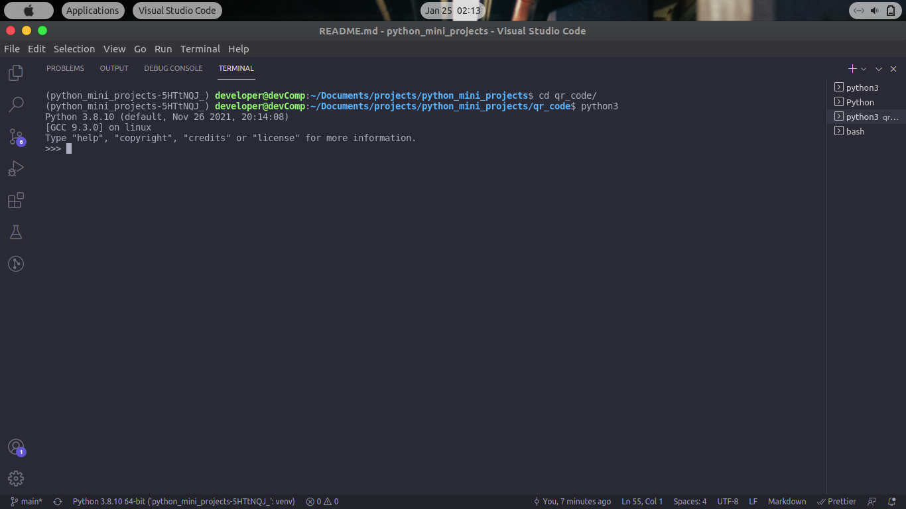
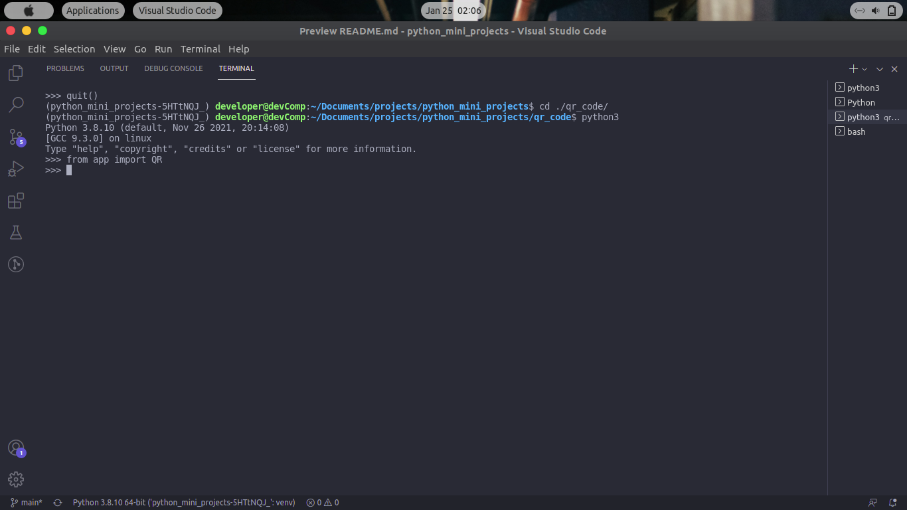
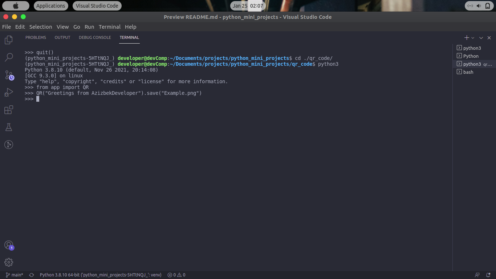

# python_mini_projects

## PROJECTS

1. ["Guess" simple game](guess/guess.py)
2. [Super password generetor](password_generator/app.py)
2. [QR Code generator](./qr_code/app.py)
<br/>

## How to use?

1. Clone this git repository
```bash
git clone https://github.com/azizbekQozoqov/python_mini_projects.git
```

2. Install requirements

```bash
pip install -r requirements.txt
```
<br />

- Guess

Go to the ```python_mini_projects``` folder
```bash
cd ./guess/
```
```bash
python3 run.py
```
<br />

- Super password generator

Go to the ```python_mini_projects``` folder
```bash
cd ./password_generator/
```
```bash
python3 app.py
```

<br />

Go to the ```python_mini_projects``` folder
```bash
cd ./qr_code/
```
Run the python in your terminal
```bash
python3
```



import the QR class 
```bash
from app import QR
```



```bash
QR("Greetings from AzizbekDeveloper").save("Example.png")
```



You can get image like that


You can also use this module in your projects